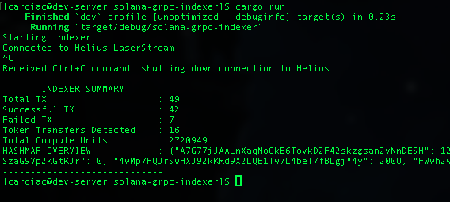
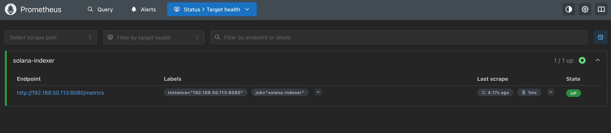
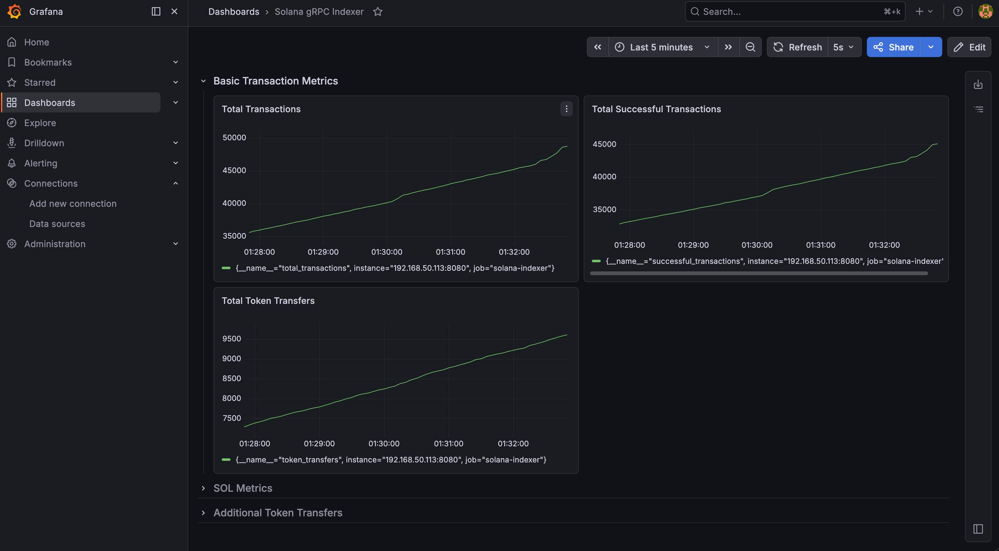
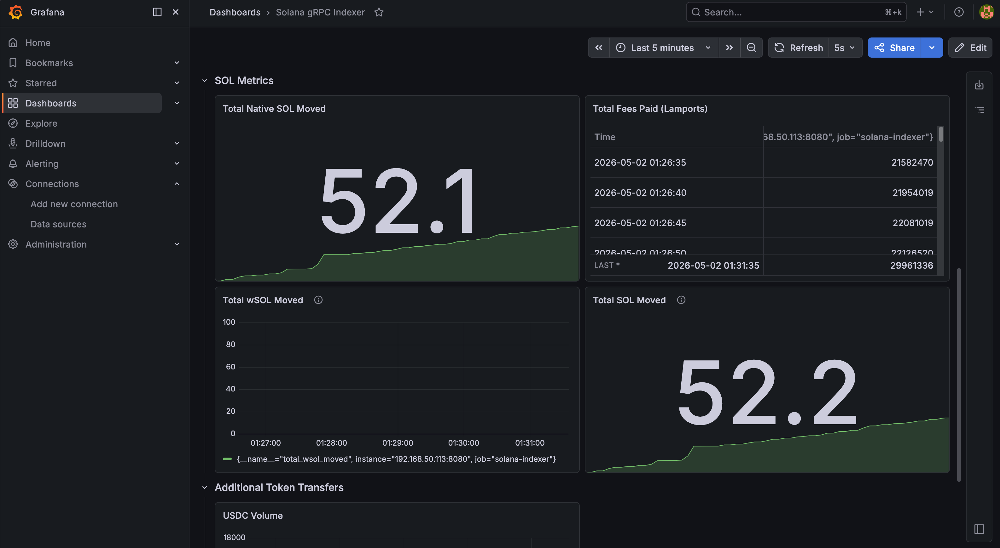
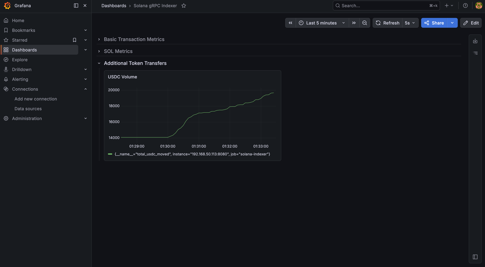

# Real-time Solana Transaction Indexer
Transaction indexer using Helius LaserStream (Yellowstone gRPC), Rust, Tokio, and PostgreSQL

## Features

- Real-time transaction streaming via Helius LaserStream
- Parsing of native SOL, wrapped SOL, and SPL token transfers
- Prometheus metrics endpoint
- Live Grafana dashboards of token metrics
- Clean architecture with separation of concerns

## Tech Stack

- Rust + Tokio + Actix Web
- Helius LaserStream (gRPC)
- Prometheus + Grafana
- Docker Compose
- PostgreSQL (planned for historical data storage and analysis)

## Quick Start

1.  Clone the repo\
    ```git clone https://github.com/toska-j1337/solana-grpc-indexer.git```\
    ```cd solana-grpc-indexer```

3.  Copy and configure environment
    ```cp .env.example .env```
    Edit .env with your Helius API key

4.  Configure Prometheus.yml target\
    Edit prometheus.yml target to the IP:PORT of your Actix/Tokio server. \
    - Example `targets: [192.168.50.113:8080]`

5.  Start Prometheus and Grafana for observability
    ```docker compose up -d```

6.  Run the indexer
    ```cargo run```

7.  Open Grafana at http://YOUR_IP_ADDRESS:3000 *(default login: admin/admin)*

## Screenshots

**Terminal Output**


**Prometheus Targets**


**Basic Transaction Metrics**


**SOL Metrics**


**Additional Token Metrics**


## Roadmap
- Async PostgreSQL bulk inserts for historical data
- Enhanced transaction parsing and metrics handling
- REST API for querying live/historical data

Seeking junior Rust roles, preferably remote.
- toska.admin@proton.me
